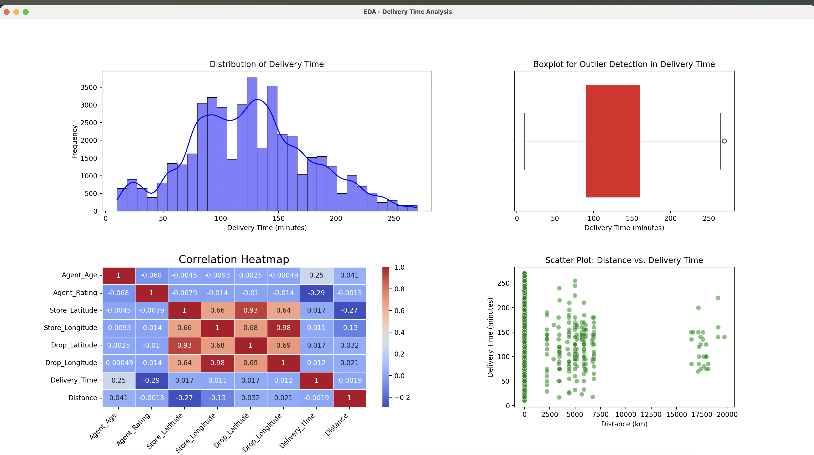

# Amazon Delivery Time Prediction

## Overview

This project aims to predict the delivery time for Amazon e-commerce orders based on various factors such as product size, shipping distance, traffic conditions, and shipping method. The prediction model is built using machine learning techniques, and the results are presented interactively through a web app built with **Streamlit**.

## Technologies Used

- **Python**: For data processing, machine learning model building, and web app development.
- **Machine Learning**: Algorithms like **Random Forest** to predict delivery times based on the input features.
- **MLflow**: For experiment tracking, model management, and evaluation.
- **Streamlit**: For creating an interactive web interface to visualize predictions.
- **Git/GitHub**: For version control and collaboration.

## Project Structure

```
amazon_delivery_time_prediction/
│── src/
│   ├── charts.py               # Visualization functions
│   ├── data_preparation.py     # Data loading and preprocessing
│   ├── data_visualization.py   # Data visualization and exploratory analysis
│   ├── feature_engineering.py  # Feature extraction & transformation
│   ├── model_tracking.py       # MLflow model tracking
│   ├── model_training.py       # Training machine learning models
│   ├── model_training_v2.py    # Optimized model training
│   ├── model_tuning.py         # Hyperparameter tuning
│   ├── validate_model.py       # Model validation
│── streamlit_app/
│   ├── main.py                 # Streamlit main entry point
│── tests/
│   ├── test_model_pipeline.py  # Unit tests for model pipeline
│── models/                     # Stores trained models (e.g., best_model.pkl)
│── mlruns/                     # MLflow logs & experiment tracking
│── requirements.txt            # Dependencies required for the project
│── README.md                   # Project documentation
│── .gitignore                   # Files to be ignored by Git
```

## Data Processing Workflow

### 1. **Data Cleaning** (`data_preparation.py`)
- Handle missing values by using appropriate imputation techniques.
- Convert categorical variables to numerical representations.
- Remove duplicate entries and inconsistent records.
- Standardize column names and correct data formats.

### 2. **Exploratory Data Analysis (EDA)** (`charts.py`)
- Generate histograms, boxplots, and scatterplots to analyze distributions.
- Compute correlation heatmaps to identify relationships between features.
- Detect and remove outliers affecting predictions.

### 3. **Feature Engineering** (`feature_engineering.py`)
- Extract new meaningful features such as delivery speed categories.
- Apply transformations like log scaling to normalize data.
- Encode categorical features using one-hot encoding or label encoding.

## Model Development

### 4. **Machine Learning Model Training** (`model_training.py` & `model_training_v2.py`)
- Train a **Random Forest Regressor** as the primary model.
- Optimize hyperparameters using **GridSearchCV**.
- Evaluate model performance using **RMSE, MAE, and R-squared scores**.

#### **Model Parameters:**
- **Algorithm:** Random Forest Regressor
- **Hyperparameters:**
  - `n_estimators`: 100
  - `max_depth`: 10
  - `min_samples_split`: 5
  - `min_samples_leaf`: 2
  - `random_state`: 42

### 5. **Model Validation** (`validate_model.py`)
- Perform cross-validation and hold-out validation.
- Check for overfitting and bias-variance tradeoff.

### 6. **Model Experiment Tracking with MLflow** (`model_tracking.py`)
```sh
mlflow ui
```
- Open **http://localhost:5000** in your browser to view logged metrics.
- Compare different model versions and performance improvements.

## Running the Project

### 1. **Clone the Repository**
```sh
git clone https://github.com/TejaswiPodilaGitUser/amazon_delivery_time_prediction.git
cd amazon_delivery_time_prediction
```

### 2. **Create a Virtual Environment** (Optional but recommended)
```sh
python -m venv venv
source venv/bin/activate  # For macOS/Linux
venv\Scripts\activate  # For Windows
```

### 3. **Install Dependencies**
```sh
pip install -r requirements.txt
```

### 4. **Train the Model**
```sh
python src/model_training.py
```
For the optimized version, use:
```sh
python src/model_training_v2.py
```

### 5. **Run the Streamlit App**
```sh
streamlit run streamlit_app/main.py
```
The app will open in your browser, allowing you to input various delivery parameters and view the predicted delivery time.

## Testing
To test the model pipeline, run:
```sh
PYTHONPATH=src pytest tests/test_model_pipeline.py
```
This runs unit tests to validate the preprocessing, model predictions, and edge cases.

## Visualizations

### 1️⃣ Histogram - Delivery Time Distribution
- Shows how delivery times are distributed.
- Helps in identifying delays and trends.

### 2️⃣ Correlation Heatmap
- Visualizes relationships between features.
- Helps in feature selection.

### 3️⃣ Boxplot for Outlier Detection
- Identifies extreme values that might distort predictions.

### 4️⃣Scatter Plot: Distance vs. Delivery Time
- Displays the relationship between distance traveled and delivery time.
- Helps identify patterns such as whether longer distances lead to increased delivery times.
- Useful for detecting anomalies where short distances have unusually long delivery times, indicating potential operational inefficiencies.



### MLflow UI 
- helps track experiments, compare models, and visualize metrics efficiently. It ensures reproducibility and model versioning.


## Streamlit UI


## Learnings

- **Machine Learning**: Built an ML model using **Random Forest** for delivery time prediction.
- **Data Preprocessing**: Cleaned and prepared data for training.
- **EDA**: Analyzed trends, distributions, and correlations.
- **Feature Engineering**: Created new variables to improve model performance.
- **MLflow**: Used MLflow for model tracking and experiment management.
- **Streamlit**: Developed an interactive web app to visualize predictions.
- **Software Engineering**: Followed best practices in structuring the project, testing, and version control with Git/GitHub.

---

🚀 **Ready to explore the future of delivery time prediction? Start using this project today!**

